# aws-ssm-demo 🐳


[](https://github.com/tquangdo/aws-ssm-demo/issues/new)

## reference
1. [aws](https://aws.amazon.com/getting-started/hands-on/remotely-run-commands-ec2-instance-systems-manager/)
2. [vtitechblog](https://vtitech.vn/connect-den-private-server-thong-qua-session-manager/)
3. [awsstudygroup1](https://000031.awsstudygroup.com/vi)
4. [awsstudygroup2](https://000058.awsstudygroup.com/vi)

## EC2
- launch instance:
- 1. AMI=`linux`
> ref 3: AMI=`win server`
- 2. role name=`DTQRoleSSM`, policy name=`AmazonEC2RoleforSSM`
> ref 3: policy name=`AmazonSSMManagedInstanceCore`

## ref 1.
1. ### 1-1/ run command
    - SSM left tab: click `run command` > `run a command`
    - type=`AWS-RunShellScript`
    > ref 3: type=`AWS-RunPowerShellScript`
    - Command parameters=`sudo yum update -y`
    > ref 3: Command parameters=`net user`
    - Targets=`Choose instances manually` > select EC2
    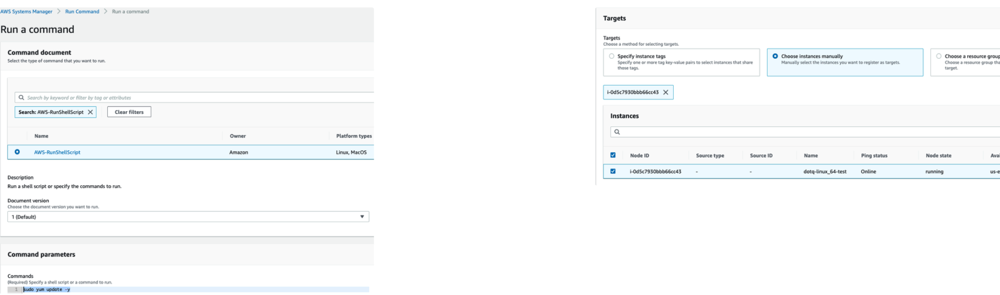
    - click `Run`
    - see output: choose `instance ID` > click `View output`
    
    ---
    > ref 3:
    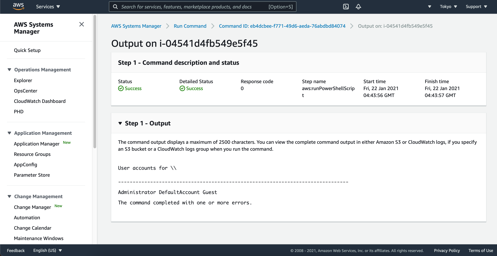
1. ### 1-2/ Session Manager
    - SSM left tab: click `Session Manager` > `Start Session`
    - Target instances: select EC2
    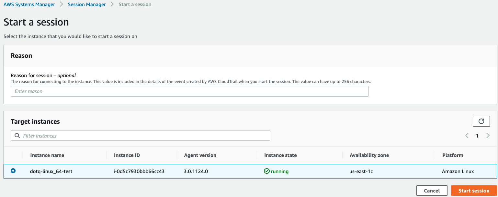
    - click `start session`
    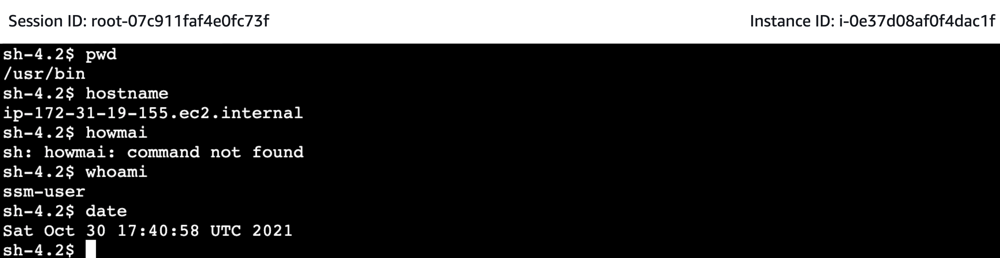

## ref 2.
1. ### 2-1/ y nghia thay cho EC2 bastion
    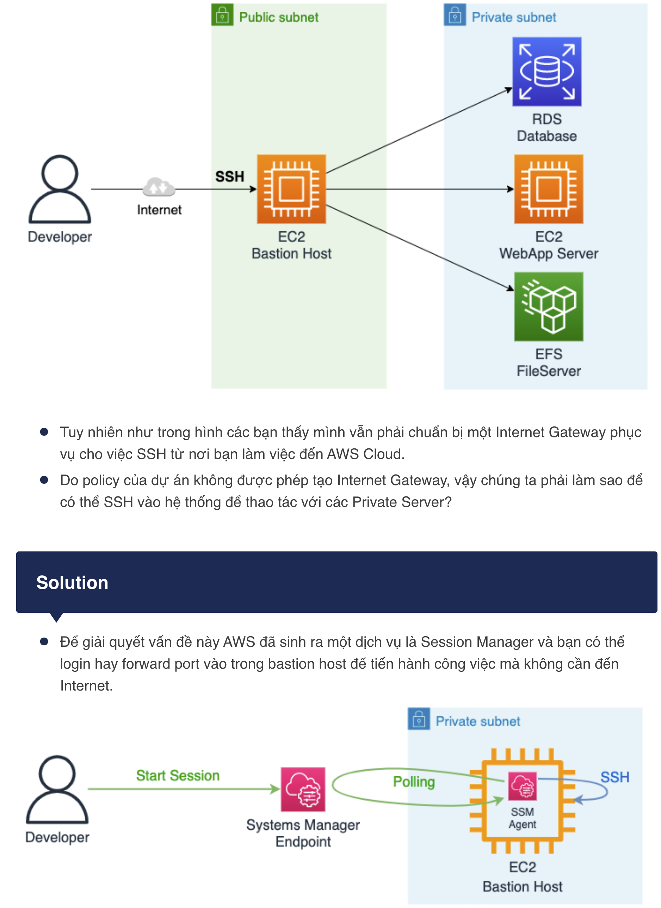
1. ### 2-2/ AWS CLI
    1. #### connect to server (like ssh)
        ```shell
        # TH KO attach IAM role `DTQRoleSSM`
        aws ssm start-session --target i-0d5c7930bbb66cc43 --profile default
        An error occurred (TargetNotConnected) when calling the StartSession operation: i-0d5c7930bbb66cc43 is not connected.

        # TH co attach IAM role
        aws ssm start-session --target i-0d5c7930bbb66cc43 --profile default
        Starting session with SessionId: dotqadm-00854d7434e4d2d3b # "dotqadm" chinh la IAM username
        sh-4.2$ hostname
        -> ip-172-31-30-29.ec2.internal
        ```
    1. #### connect tu local browser KO can thong qua internet
        ```shell
        aws ssm start-session --target i-0d5c7930bbb66cc43 --profile default --document-name AWS-StartPortForwardingSession \
        --parameter "localPortNumber=10022,portNumber=10022"
        ->
        Starting session with SessionId: dotqadm-0071a551b594168de
        Port 10022 opened for sessionId dotqadm-0071a551b594168de.
        Waiting for connections...
        ```
        - Mở một terminate khác và tiến hành chạy port forwarding đến endpoint bạn mong muốn thông qua SSH (chưa làm!!!💣💣)
        ```shell
        ssh -i bastionHostKey.pem ec2-user@localhost -p 10022 -L 8443:${WEB_APP_ENDPOINT}:443
        ```
        - Sau khi chạy xong bạn có thể mở https://localhost:8443 để đến với server private từ máy local rồi!

## ref 3: Patch Manager
- SSM left tab: click `Fleet Manager` > will show all running EC2
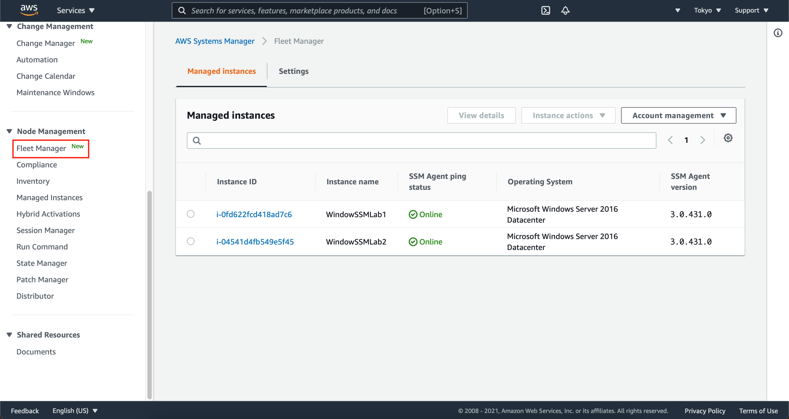
- select `Instance ID` > click `Instance actions` > choose `Start session`
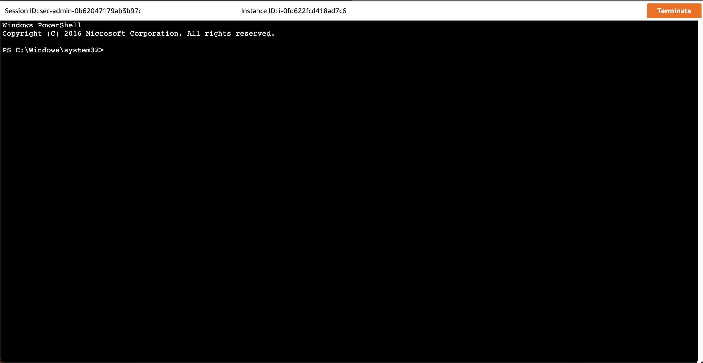
- SSM left tab: click `Patch Manager` > click `Patch now`
- select `Scan and install` + `Patch only the target instances I specify -> Choose instance manually`
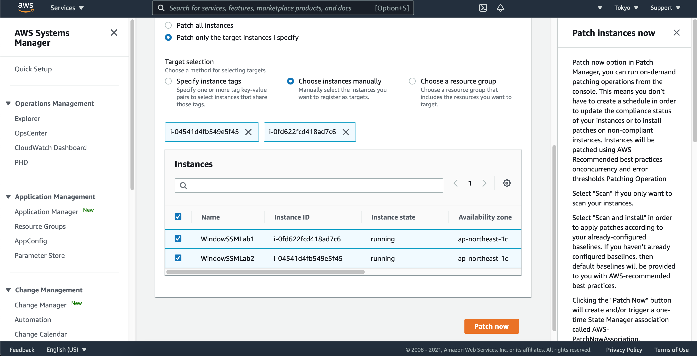
- select EC2 > click `Patch Now`
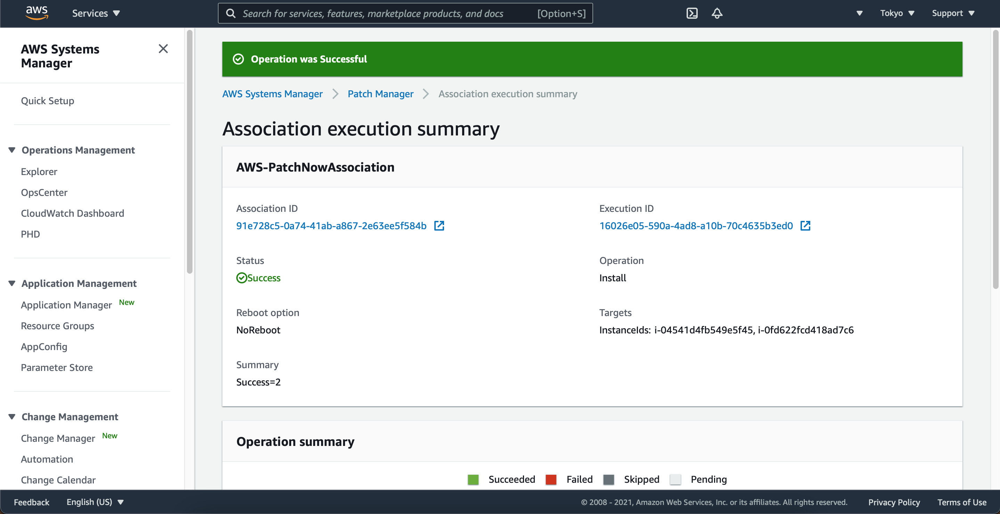

## ref 4.
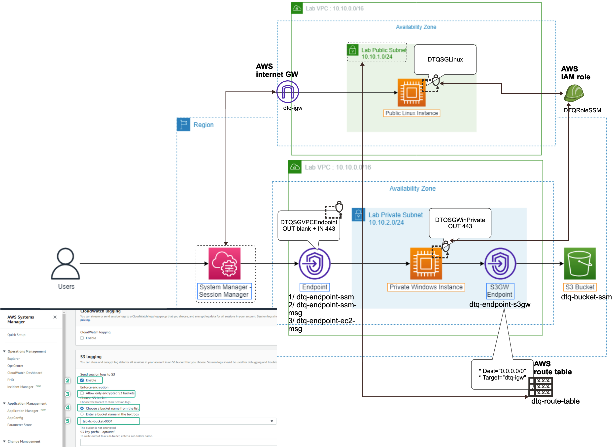
1. ### Tạo kết nối đến máy chủ EC2 Private
    1. #### Kích hoạt DNS hostnames
    1. #### Tạo VPC Endpoint
        - Chúng ta sẽ tạo 3 interface endpoint yêu cầu bởi [Session Manager](https://docs.aws.amazon.com/systems-manager/latest/userguide/session-manager-prerequisites.html#:~:text=Connectivity%20to%20endpoints):
        ```
        com.amazonaws.region.ssm
        com.amazonaws.region.ec2messages
        com.amazonaws.region.ssmmessages
        ```
1. ### Quản lý session logs
    - Với Session Manager chúng ta có thể xem được lịch sử các kết nối tới các instance thông qua Session history. Tuy nhiên chúng ta chưa xem được chi tiết các câu lệnh được sử dụng
    - sau khi config s3gw endpoint xong thì có thể xem dc chi tiết logs như sau:
    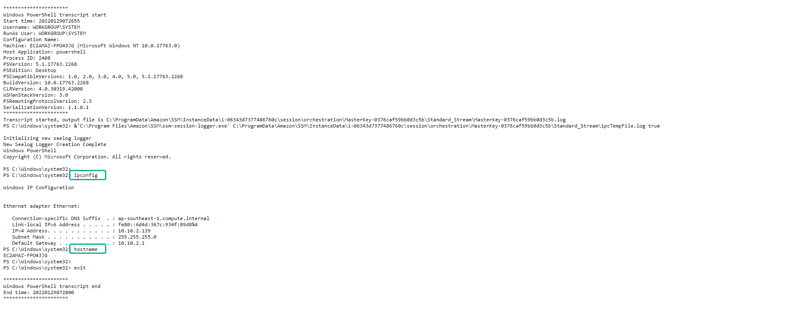

1. ### Port Forwarding
    - Port Forwarding là cách thức hữu ích để chuyển hướng lưu lượng mạng từ 1 địa chỉ IP - Port này sang 1 địa chỉ IP Port khác.
    - Với Port Forwarding chúng ta có thể truy cập một EC2 instance nằm trong private subnet từ máy trạm của chúng ta
    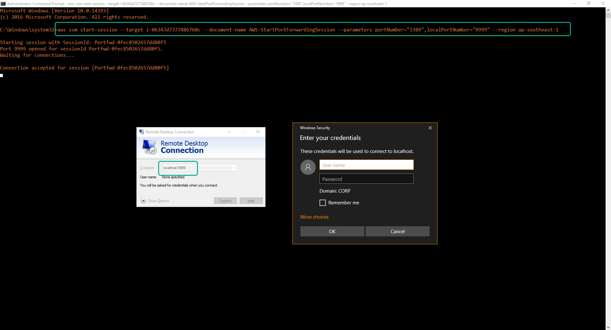
---
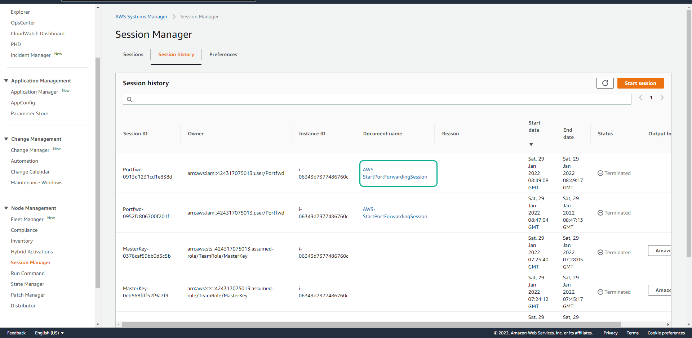

## delete AWS resources of ref 4.
```shell
./del_aws_resource.sh
```
